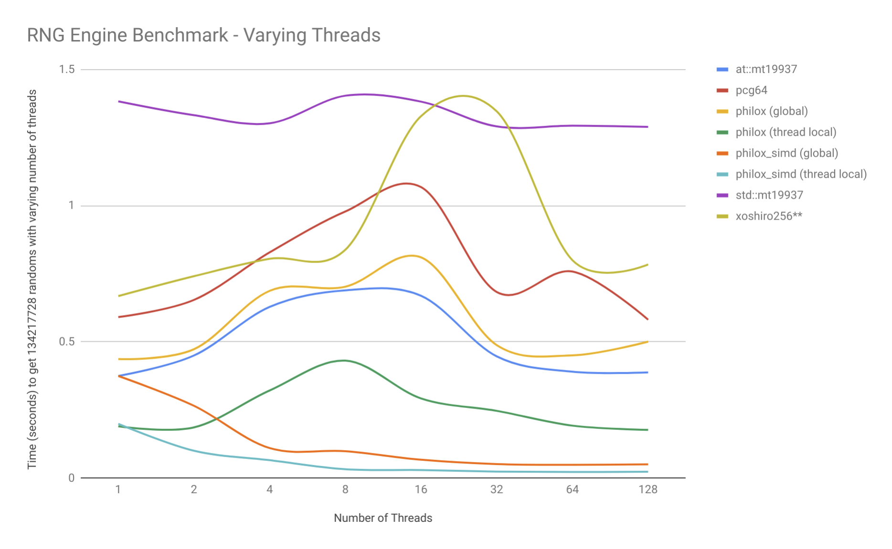
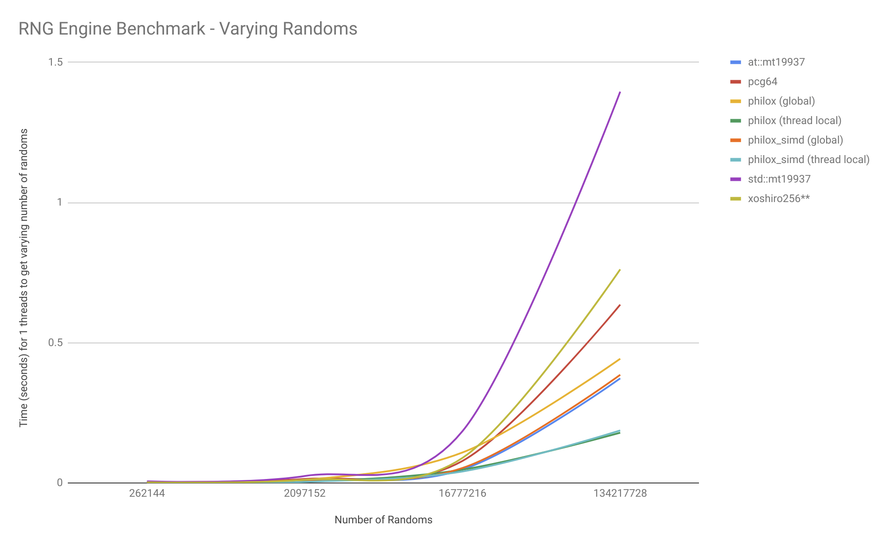

# Random Number Engine Benchmark

`benchmark.cpp` benchmarks `Philox.h`, `PhiloxSIMD.h` `xoshiro256starstar.h`, `PCG.h` and `std::mt19937`

Build and run with the following instructions:
```
g++ --std=c++11 -O3 -pthread -march=native fort.c functions.cpp benchmark.cpp -lm -o bench
./bench
```

# Usage:
```
Random Number Engine Benchmark
Usage: ./bench [OPTIONS]

Options:
  -h,--help                   Print this help message and exit
  -l,--loop-count UINT        Number of randoms to produce
  -t,--num-threads INT        Number of threads
[Option Group: benchmark_type]
  Decides if the independent variable is number of threads or number of randoms 
  [At most 1 of the following options are allowed]
  Options:
    --benchmark-threads UINT    Run full benchmark with increasing number of threads
    --benchmark-loop-count UINT Run full benchmark with increasing number of randoms
```

# Results:

Benchmarked on Intel(R) Xeon(R) CPU E5-1660 v4 @ 3.20GHz with GCC 5.4.0
### Benchmark with varying number of threads:
```
g++ --std=c++11 -O3 -pthread -march=native fort.c functions.cpp benchmark.cpp -lm -o bench
./bench --benchmark-threads true
```
#### Summary: Time (seconds) to get 134217728 randoms with varying number of threads
| Number of Threads | at::mt19937 |  pcg64   | philox (global) | philox (thread local) | philox_simd (global) | philox_simd (thread local) | std::mt19937 | xoshiro256** |
|-------------------|-------------|----------|-----------------|-----------------------|----------------------|----------------------------|--------------|--------------|
| 1                 | 0.375106    | 0.591068 | 0.437020        | 0.190320              | 0.374932             | 0.199113                   | 1.382789     | 0.668182     |
| 2                 | 0.450111    | 0.654107 | 0.473145        | 0.186203              | 0.265429             | 0.100436                   | 1.332026     | 0.741194     |
| 4                 | 0.628427    | 0.828637 | 0.687465        | 0.321640              | 0.110236             | 0.065814                   | 1.302336     | 0.805002     |
| 8                 | 0.689376    | 0.978750 | 0.702563        | 0.431225              | 0.098752             | 0.032499                   | 1.403701     | 0.838371     |
| 16                | 0.669293    | 1.068228 | 0.810194        | 0.292575              | 0.067606             | 0.029650                   | 1.381778     | 1.328682     |
| 32                | 0.446878    | 0.682952 | 0.488135        | 0.246906              | 0.051608             | 0.023925                   | 1.290834     | 1.346120     |
| 64                | 0.390613    | 0.758192 | 0.450836        | 0.192623              | 0.048729             | 0.022513                   | 1.293453     | 0.799838     |
| 128               | 0.388140    | 0.581354 | 0.501050        | 0.176927              | 0.050463             | 0.023684                   | 1.289084     | 0.784333     |



### Benchmark with varying number of randoms:
```
g++ --std=c++11 -O3 -pthread -march=native fort.c functions.cpp benchmark.cpp -lm -o bench
./bench --benchmark-loop-count true
```
#### Summary: Time (seconds) for 1 threads to get varying number of randoms
| Number of Randoms | at::mt19937 |  pcg64   | philox (global) | philox (thread local) | philox_simd (global) | philox_simd (thread local) | std::mt19937 | xoshiro256** |
|-------------------|-------------|----------|-----------------|-----------------------|----------------------|----------------------------|--------------|--------------|
| 8                 | 0.000024    | 0.000025 | 0.000024        | 0.000024              | 0.000028             | 0.000024                   | 0.000025     | 0.000023     |
| 64                | 0.000024    | 0.000024 | 0.000024        | 0.000024              | 0.000026             | 0.000024                   | 0.000025     | 0.000025     |
| 512               | 0.000028    | 0.000030 | 0.000028        | 0.000026              | 0.000028             | 0.000026                   | 0.000039     | 0.000031     |
| 4096              | 0.000056    | 0.000074 | 0.000061        | 0.000039              | 0.000056             | 0.000040                   | 0.000143     | 0.000082     |
| 32768             | 0.000278    | 0.000437 | 0.000322        | 0.000148              | 0.000287             | 0.000154                   | 0.000984     | 0.000482     |
| 262144            | 0.001887    | 0.002882 | 0.002056        | 0.000871              | 0.001706             | 0.000853                   | 0.005784     | 0.002589     |
| 2097152           | 0.009726    | 0.014331 | 0.011185        | 0.005075              | 0.010168             | 0.004162                   | 0.024855     | 0.011402     |
| 16777216          | 0.048210    | 0.078647 | 0.108818        | 0.047557              | 0.053539             | 0.041094                   | 0.184866     | 0.089420     |
| 134217728         | 0.373109    | 0.635907 | 0.442864        | 0.179401              | 0.385669             | 0.187484                   | 1.395175     | 0.761713     |


